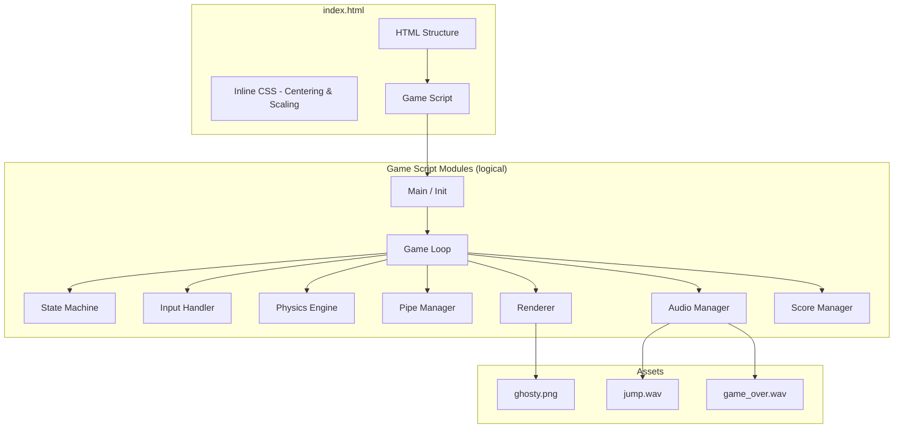
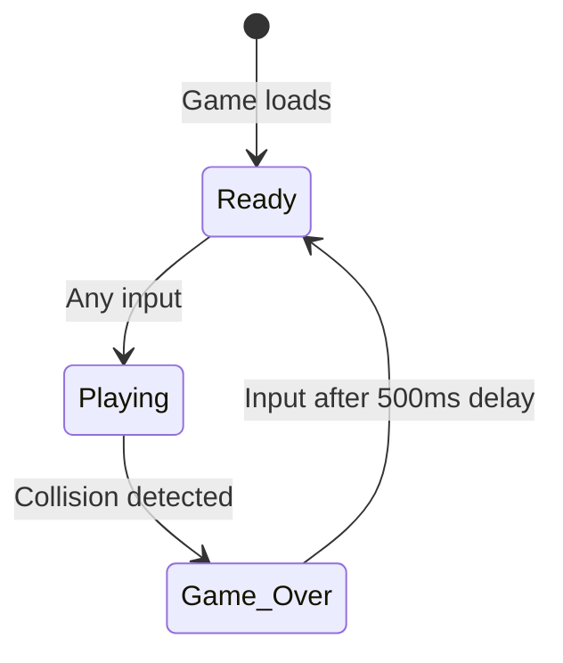

# Design Document: Flappy Kiro

## Overview

Flappy Kiro is a zero-build, single-page browser game rendered on an HTML5 Canvas. The player controls Kiro (a ghost character) by flapping upward to navigate through procedurally generated pipe obstacles. The game uses a retro 8-bit pixel-art aesthetic, runs entirely from the file system (file:// protocol), and requires no external dependencies.

The implementation consists of a single `index.html` file containing inline CSS and JavaScript (or a small set of classic script-tagged JS files), leveraging the Canvas 2D API for rendering and WebAudio API for procedural sound generation. Existing assets (`ghosty.png`, `jump.wav`, `game_over.wav`) are loaded via relative paths.

### Key Design Decisions

1. **Single-file or minimal-file architecture** — All game logic lives in one or two JS files loaded via `<script>` tags (no ES modules) to ensure file:// compatibility.
2. **Fixed-timestep game loop** — Uses `requestAnimationFrame` with delta-time accumulation to decouple physics from frame rate.
3. **Entity-component pattern (lightweight)** — Game objects (Kiro, pipes, background layers) are plain JS objects managed by update/render functions rather than a full ECS framework.
4. **Procedural rendering** — Pipes, background, and ground are drawn directly on canvas each frame; only Kiro uses a sprite image.
5. **State machine** — A simple three-state FSM (Ready → Playing → Game_Over → Ready) governs game behavior.

## Architecture



### Game Loop Architecture

```mermaid
sequenceDiagram
    participant RAF as requestAnimationFrame
    participant Loop as Game Loop
    participant State as State Machine
    participant Physics as Physics
    participant Pipes as Pipe Manager
    participant Collision as Collision Detection
    participant Renderer as Renderer

    RAF->>Loop: timestamp
    Loop->>Loop: Calculate deltaTime
    Loop->>State: Get current state
    alt State = Playing
        Loop->>Physics: update(deltaTime)
        Loop->>Pipes: update(deltaTime)
        Loop->>Collision: check()
        alt Collision detected
            Loop->>State: transition(Game_Over)
        end
    end
    Loop->>Renderer: render(state, entities)
    Loop->>RAF: request next frame
```

### File Structure

```
project-root/
├── index.html          # Single entry point with inline CSS + JS
├── assets/
│   ├── ghosty.png      # Kiro sprite (existing)
│   ├── jump.wav        # Flap sound effect (existing)
│   └── game_over.wav   # Game over sound effect (existing)
├── img/
│   └── example-ui.png  # Reference screenshot
└── README.md           # Game documentation
```

## Components and Interfaces

### 1. Main / Initialization

Responsible for bootstrapping the game: creating the canvas, loading assets, initializing subsystems, and starting the game loop.

```javascript
// Pseudocode interface
function init() → void
// - Creates canvas element (400×600)
// - Loads ghosty.png as Image
// - Initializes AudioManager
// - Registers input listeners
// - Sets initial Game_State to Ready
// - Starts game loop
```

### 2. Game Loop

The core update/render cycle driven by `requestAnimationFrame`.

```javascript
// Interface
function gameLoop(timestamp: DOMHighResTimeStamp) → void
// - Computes deltaTime from previous timestamp
// - Calls update(deltaTime) based on current state
// - Calls render()
// - Requests next animation frame

// Constants
const TARGET_FPS = 60;
const FRAME_DURATION = 1000 / TARGET_FPS; // ~16.67ms
```

### 3. State Machine

Manages transitions between the three game states.

```javascript
// States enum
const GameState = { READY: 'ready', PLAYING: 'playing', GAME_OVER: 'game_over' };

// Interface
function transitionTo(newState: GameState) → void
function getCurrentState() → GameState
function getTimeSinceStateChange() → number // milliseconds
```

### 4. Input Handler

Captures and normalizes player input across keyboard, mouse, and touch.

```javascript
// Interface
function initInput(canvas: HTMLCanvasElement) → void
function onAction(callback: () => void) → void
// - Listens for: keydown (Space, ArrowUp), mousedown, touchstart
// - Calls preventDefault() on all captured events
// - Invokes callback based on current game state
```

### 5. Physics Engine

Applies gravity and flap impulses to Kiro.

```javascript
// Interface
function updateKiroPhysics(kiro: KiroEntity, deltaTime: number) → void
function applyFlap(kiro: KiroEntity) → void

// Constants
const GRAVITY = 0.5;          // pixels/frame² (at 60fps)
const FLAP_VELOCITY = -7.5;   // pixels/frame upward
const MAX_FALL_SPEED = 12;    // pixels/frame terminal velocity
const ROTATION_UP = -20;      // degrees on flap
const ROTATION_DOWN_MAX = 90; // degrees max downward tilt
```

### 6. Pipe Manager

Handles pipe generation, scrolling, and cleanup.

```javascript
// Interface
function updatePipes(pipes: PipePair[], deltaTime: number) → PipePair[]
function trySpawnPipe(pipes: PipePair[], elapsed: number) → PipePair[]
function removePipe(pipes: PipePair[], index: number) → PipePair[]

// Constants
const PIPE_SPEED = 3;              // pixels/frame at 60fps
const PIPE_SPAWN_INTERVAL = 1500;  // milliseconds
const PIPE_WIDTH = 52;             // pixels
const GAP_HEIGHT_MULTIPLIER = 3;   // × kiro sprite height
const MIN_GAP_MARGIN = 0.10;       // 10% from top/ground
```

### 7. Collision Detection

Evaluates AABB (Axis-Aligned Bounding Box) intersections.

```javascript
// Interface
function checkCollisions(kiro: KiroEntity, pipes: PipePair[], groundY: number, canvasHeight: number) → CollisionResult

// CollisionResult
type CollisionResult = { collided: boolean, type: 'pipe' | 'ground' | 'ceiling' | null }

// AABB intersection
function aabbIntersect(a: Rect, b: Rect) → boolean
```

### 8. Renderer

Draws all game elements each frame with image smoothing disabled.

```javascript
// Interface
function render(ctx: CanvasRenderingContext2D, state: GameState, entities: GameEntities) → void
function renderBackground(ctx, layers: ParallaxLayer[], offset: number) → void
function renderPipes(ctx, pipes: PipePair[]) → void
function renderKiro(ctx, kiro: KiroEntity, spriteImage: HTMLImageElement) → void
function renderGround(ctx, offset: number) → void
function renderUI(ctx, state: GameState, score: number, highScore: number) → void
```

### 9. Audio Manager

Handles sound playback with graceful degradation.

```javascript
// Interface
function initAudio() → AudioManager | null
function playJump(manager: AudioManager) → void
function playScore(manager: AudioManager) → void   // WebAudio oscillator
function playGameOver(manager: AudioManager) → void
// All methods are no-ops if manager is null (audio unavailable)
```

### 10. Score Manager

Tracks current score and persists high score.

```javascript
// Interface
function incrementScore(scoreState: ScoreState) → ScoreState
function getHighScore() → number          // reads localStorage
function persistHighScore(score: number) → void  // writes localStorage
function resetScore(scoreState: ScoreState) → ScoreState
```

## Data Models

### KiroEntity

```javascript
{
  x: number,           // Fixed horizontal position (left third of canvas)
  y: number,           // Current vertical position (pixels from top)
  width: number,       // Sprite width (derived from aspect ratio)
  height: number,      // Sprite height (24-48 pixels)
  velocityY: number,   // Current vertical velocity (positive = down)
  rotation: number,    // Current rotation in degrees
  sprite: HTMLImageElement  // Reference to loaded ghosty.png
}
```

### PipePair

```javascript
{
  x: number,           // Horizontal position of pipe pair (left edge)
  gapCenterY: number,  // Vertical center of the gap
  gapHeight: number,   // Height of the gap opening
  width: number,       // Pipe width (constant: 52px)
  scored: boolean,     // Whether Kiro has passed this pipe
  // Derived bounds:
  topPipe: { x, y: 0, width, height: gapCenterY - gapHeight/2 },
  bottomPipe: { x, y: gapCenterY + gapHeight/2, width, height: canvasHeight - groundHeight - (gapCenterY + gapHeight/2) }
}
```

### ParallaxLayer

```javascript
{
  color: string,       // Fill color for this layer
  elements: Array<{ x: number, y: number, width: number, height: number }>,
  speedMultiplier: number,  // Fraction of pipe speed (0.25 to 0.5)
  offsetX: number      // Current scroll offset
}
```

### ScoreState

```javascript
{
  current: number,     // Current game score
  high: number         // All-time high score from localStorage
}
```

### GameEntities (aggregate)

```javascript
{
  kiro: KiroEntity,
  pipes: PipePair[],
  backgroundLayers: ParallaxLayer[],
  groundOffset: number,
  score: ScoreState
}
```

### GameConfig (constants)

```javascript
{
  CANVAS_WIDTH: 400,
  CANVAS_HEIGHT: 600,
  GROUND_HEIGHT: 60,           // ~10% of canvas height
  GRAVITY: 0.5,
  FLAP_VELOCITY: -7.5,
  PIPE_SPEED: 3,
  PIPE_SPAWN_INTERVAL: 1500,
  PIPE_WIDTH: 52,
  GAP_HEIGHT: 120,             // ~3× kiro height (40px)
  KIRO_X: 80,                  // Fixed X position (left third)
  KIRO_HEIGHT: 36,             // Sprite height
  RESTART_DELAY: 500,          // ms before restart allowed
  MIN_GAP_MARGIN: 0.10,
  SCORE_SOUND_DURATION: 150    // ms for oscillator beep
}
```

### State Transition Diagram



## Correctness Properties

*A property is a characteristic or behavior that should hold true across all valid executions of a system—essentially, a formal statement about what the system should do. Properties serve as the bridge between human-readable specifications and machine-verifiable correctness guarantees.*

### Property 1: Gravity and Flap Velocity

*For any* initial vertical velocity and any positive delta-time, applying a physics update SHALL increase Kiro's downward velocity by exactly `GRAVITY * (deltaTime / FRAME_DURATION)`, and applying a Flap SHALL set Kiro's velocity to exactly `FLAP_VELOCITY` regardless of the current velocity.

**Validates: Requirements 4.1, 4.2**

### Property 2: Kiro Horizontal Position Invariant

*For any* sequence of physics updates, flap applications, and state transitions, Kiro's horizontal position SHALL remain constant at its initial value and SHALL be located within the left third of the canvas width (x < CANVAS_WIDTH / 3).

**Validates: Requirements 4.3**

### Property 3: Rotation Bounds

*For any* Kiro state, the rotation SHALL be bounded between the upward flap angle (−30° to −15° immediately after a flap) and a maximum downward angle of 90°. Specifically: after a flap, rotation is in [−30, −15] degrees; during freefall, rotation is proportional to downward velocity and never exceeds 90°.

**Validates: Requirements 4.4, 4.5**

### Property 4: Pipe Generation Constraints

*For any* generated Pipe_Pair, the gap center SHALL be positioned such that the entire gap remains at least 10% of the canvas height away from both the top edge and the ground boundary, AND the gap height SHALL be at least 3 times Kiro's sprite height.

**Validates: Requirements 5.2, 5.3**

### Property 5: Pipe Lifecycle Bounds

*For any* Pipe_Pair, it SHALL spawn with x >= CANVAS_WIDTH (beyond right edge), scroll left by exactly `PIPE_SPEED * (deltaTime / FRAME_DURATION)` pixels per update, and after any update, no pipe in the active array SHALL have `x + width < 0` (removed when fully off-screen).

**Validates: Requirements 5.4, 5.5, 5.6**

### Property 6: AABB Collision Detection Correctness

*For any* two axis-aligned rectangles A and B, the collision function SHALL return true if and only if A.x < B.x + B.width AND A.x + A.width > B.x AND A.y < B.y + B.height AND A.y + A.height > B.y.

**Validates: Requirements 6.1**

### Property 7: Boundary Collision Detection

*For any* Kiro position, ground collision SHALL be detected if and only if `kiro.y + kiro.height >= groundY`, and ceiling collision SHALL be detected if and only if `kiro.y <= 0`.

**Validates: Requirements 6.2, 6.3**

### Property 8: Score Increment and High Score Update

*For any* Kiro horizontal position and Pipe_Pair, the score SHALL increment by exactly 1 when `kiro.x > pipe.x + pipe.width` AND `pipe.scored === false`, and the pipe SHALL be marked as scored. Furthermore, *for any* current score exceeding the stored high score, the high score SHALL be updated to equal the current score.

**Validates: Requirements 7.1, 7.4**

### Property 9: Canvas Scaling Preserves Aspect Ratio

*For any* viewport dimensions (width, height), the computed canvas display scale SHALL preserve the 2:3 aspect ratio (400:600). When both viewport dimensions exceed 400×600, scale SHALL be exactly 1 (no upscaling). When either dimension is smaller, scale SHALL be `min(viewportWidth/400, viewportHeight/600)` and the canvas SHALL fit entirely within the viewport.

**Validates: Requirements 2.3, 11.3, 11.4**

### Property 10: Game_Over Input Delay

*For any* elapsed time since the Game_Over transition, player input SHALL be ignored if elapsed < 500 milliseconds, and SHALL be accepted (triggering reset and transition to Ready) if elapsed >= 500 milliseconds.

**Validates: Requirements 3.5**

## Error Handling

### Audio Failures

- If `ghosty.png` fails to load, the game should still initialize with a fallback colored rectangle as the Kiro sprite.
- If `jump.wav` or `game_over.wav` fail to load, the AudioManager stores `null` references and all play methods become no-ops.
- If the WebAudio API is unavailable (e.g., older browsers or restrictive policies), the AudioManager initializes as `null` and the game proceeds silently.
- Audio context creation is wrapped in try/catch; failures are swallowed silently.

### localStorage Failures

- If `localStorage.getItem()` throws (private browsing, storage full), the high score defaults to 0.
- If `localStorage.setItem()` throws, the high score update is silently skipped; the in-memory high score remains correct for the current session.

### Rendering Failures

- If `requestAnimationFrame` is unavailable (extremely old browsers), the game does not start and no error is shown. This is outside the supported browser matrix.
- Canvas context acquisition (`getContext('2d')`) failure prevents initialization; a static message could be shown in the HTML fallback.

### Input Edge Cases

- Rapid repeated inputs (key held down) are handled by only processing `keydown` events (not `keypress` or repeated `keydown` from key repeat) — the first keydown triggers a flap, subsequent repeats are ignored until key is released.
- Touch events call `preventDefault()` to avoid scroll/zoom interference.

## Testing Strategy

### Unit Tests (Example-Based)

Unit tests cover specific scenarios, edge cases, and integration points:

- **Input mapping**: Verify each input type (Space, ArrowUp, mousedown, touchstart) triggers the correct action in each state.
- **State transitions**: Verify Ready→Playing, Playing→Game_Over, Game_Over→Ready transitions with correct side effects.
- **Rendering output**: Verify correct elements are drawn for each state (snapshot or mock-canvas approach).
- **Audio integration**: Verify correct audio methods are called on flap, score, and game over events.
- **Edge cases**: localStorage unavailable, audio load failure, zero-size viewport.

### Property-Based Tests

Property-based tests validate universal correctness properties using a library such as **fast-check** (JavaScript PBT library).

**Configuration:**
- Minimum 100 iterations per property test
- Each test tagged with: `Feature: flappy-kiro, Property {N}: {title}`

**Properties to implement:**
1. Gravity and flap velocity correctness
2. Kiro horizontal position invariant
3. Rotation bounds enforcement
4. Pipe generation constraint validation
5. Pipe lifecycle bounds (spawn, scroll, removal)
6. AABB collision detection geometric correctness
7. Boundary collision detection (ground + ceiling)
8. Score increment and high score update logic
9. Canvas scaling aspect ratio preservation
10. Game_Over input delay enforcement

### Integration Tests

- **Game loop integration**: Verify that one full frame update in Playing state calls physics, pipes, collision, and render in correct order.
- **Full game cycle**: Simulate Ready → Playing → score a point → collide → Game_Over → restart cycle.
- **Resize handling**: Verify canvas rescales on window resize events.

### Manual Testing

- **Visual verification**: Pixel-art rendering, parallax scrolling, pipe appearance, rotation animation.
- **Cross-browser**: Test on Chrome, Firefox, Safari (latest 2 major versions).
- **Performance**: Verify 60fps target is maintained, no drops below 30fps.
- **File protocol**: Verify game loads correctly from file:// URL.

